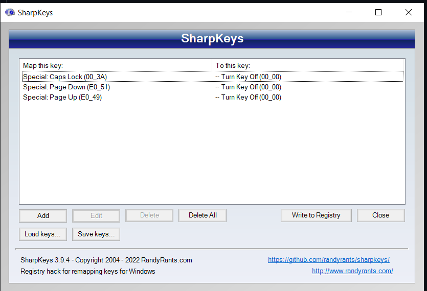

# sys config

*bios*

- disable security measures for thunderport
- set system suspend (i think?) to Win11 instead of Linux
- increase display refresh rate: `Advanced Display Settings > Refresh Rate`

*increase trackpad speed*

- see: https://docs.microsoft.com/en-us/windows-hardware/design/component-guidelines/touchpad-tuning-guidelines
- "touchpad settings" → (MAXED)
- mouse settings in control panel → (MAXED)
- Registrierungseditor (mouse settings and touchpad settings) → (MAXED)
- `Computer\HKEY_CURRENT_USER\Control Panel\Mouse` → mouse speed to 2
- `Computer\HKEY_CURRENT_USER\Software\Microsoft\Windows\CurrentVersion\PrecisionTouchPad` → cursor speed to 20
- "control your mouse with a keypad": pointer speed in system settings → (should stay OFF)

*lenovo vantage*

- go to power settings and set max limit for battery charging when plugged in

*wsl*

- https://docs.microsoft.com/en-us/windows/wsl/install
     - `wsl install`
     - `wsl --list --verbose`
     - `wsl --set-default-version 2`
- downlaod the “Terminal” app from the app store, configure it to open up Ubuntu bash and the dev folder on startup.
- `sudo apt install preload`
- configure github for WSL: https://learn.microsoft.com/en-us/windows/wsl/tutorials/wsl-git

*disable caps lock*

- https://github.com/randyrants/sharpkeys
- https://www.randyrants.com/sharpkeys/faq.htm
- `winget install -e --id XPFFCG7M673D4F`

# apps

- google drive download
- logitech options+
- python: install first to avoid weird path variables
- choclatey: https://chocolatey.org/install
     - sudo command for powershell: https://www.delftstack.com/howto/powershell/powershell-sudo/#:~:text=The%20sudo%20command%20is%20one,can%20completely%20control%20the%20system
- winget: https://docs.microsoft.com/en-us/windows/package-manager/winget/
- Scoop: https://scoop.sh/
- Power toys (tile management, muting microphone): https://docs.microsoft.com/en-us/windows/powertoys/](https://docs.microsoft.com/en-us/windows/powertoys/
     - enable admin mode on start of the app
     - disable showing mouse on pressing `alt` key twice
