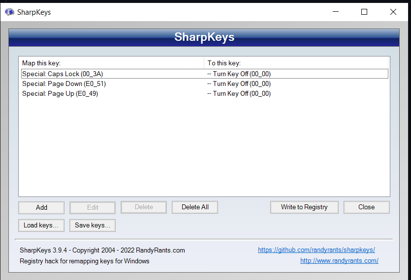

# Config

- disable security measures for thunderport in BIOS
- set system suspend (i think?) to Win11 instead of Linux in BIOS

- Increase display refresh rate

     `Advanced Display Settings > Refresh Rate`

- make mouse in trackpad faster

     - instructions

          1. "touchpad settings" -> (MAXED)

          2. mouse settings in control panel --> (MAXED)

          3. Registrierungseditor (mouse settings and touchpad settings) -> (MAXED)
             [[https://docs.microsoft.com/en-us/windows-hardware/design/component-guidelines/touchpad-tuning-guidelines](https://docs.microsoft.com/en-us/windows-hardware/design/component-guidelines/touchpad-tuning-guidelines)](<https://docs.microsoft.com/en-us/windows-hardware/design/component-guidelines/touchpad-tuning-guidelines](https://docs.microsoft.com/en-us/windows-hardware/design/component-guidelines/touchpad-tuning-guidelines)>)
             Computer\HKEY_CURRENT_USER\Control Panel\Mouse -> mouse speed to 2
             Computer\HKEY_CURRENT_USER\Software\Microsoft\Windows\CurrentVersion\PrecisionTouchPad -> cursor speed to 20

          - "control your mouse with a keypad": pointer speed in system settings --> (should stay OFF)

     With logitech mice just download “options+” and set the sensitivity inside the app.

- disable caps lock + page-up / page-down keys

     [https://github.com/randyrants/sharpkeys](https://github.com/randyrants/sharpkeys)

     [https://www.randyrants.com/sharpkeys/faq.htm](https://www.randyrants.com/sharpkeys/faq.htm)

     `winget install -e --id XPFFCG7M673D4F`

     mappings on lenovo laptop:

     

     mappings on microsoft “surface book 2” laptop:

     

- WSL + Terminal

     1. First install WSL

           [https://docs.microsoft.com/en-us/windows/wsl/install](https://docs.microsoft.com/en-us/windows/wsl/install)

           `wsl install`

           `wsl --list --verbose`

           `wsl --set-default-version 2`

     2. Then downlaod the “Terminal” app from the app store:

           Configure it to open up Ubuntu bash and the dev folder on startup.

           It should automatically open when you start your PC.

     3. Update

           `sudo apt-get update -y`

           improve performance: `sudo apt install preload`

     4. Configure github for WSL (different than anything else):

           see: [https://learn.microsoft.com/en-us/windows/wsl/tutorials/wsl-git](https://learn.microsoft.com/en-us/windows/wsl/tutorials/wsl-git)

           `sudo apt install git`

           `git config --global user.name "Yahya Jabary"`

           `git config --global user.email "jabaryyahya@gmail.com"`

           `git config --global credential.helper "/mnt/c/Program\ Files/Git/mingw64/bin/git-credential-manager-core.exe"`

           `export GIT_SSL_NO_VERIFY=1`

     5. Get “oh my bash”

           [https://github.com/ohmybash/oh-my-bash](https://github.com/ohmybash/oh-my-bash)

           Install

           `bash -c "$(wget https://raw.githubusercontent.com/ohmybash/oh-my-bash/master/tools/install.sh -O -)"`

           Then update the theme from “font” to “purity” so you get a super short and functional prompt with spacing between each command so you don’t get lost.

           `nano ~/.bashrc`

           update `OSH_THEME="font"` to `OSH_THEME="purity"`

     6. Create dev folder for work

           ie. open up something like: `/mnt/c/Users/Yahya Jabary/dev`

           then set that directory to the start location of your “terminal” app whenever you open it up: [https://tubemint.com/make-wsl-terminal-default-directory/](https://tubemint.com/make-wsl-terminal-default-directory/)

   

# Apps

- google drive download
- logitech options+

 

- python
  install python and pip before everything else - otherwise there might be bugs regarding the chosen path and version in the environment
- choclatey
  [https://chocolatey.org/install](https://chocolatey.org/install)
     - sudo command for powershell
       [https://www.delftstack.com/howto/powershell/powershell-sudo/#:~:text=The sudo command is one,can completely control the system](https://www.delftstack.com/howto/powershell/powershell-sudo/#:~:text=The%20sudo%20command%20is%20one,can%20completely%20control%20the%20system)
- winget
  [https://docs.microsoft.com/en-us/windows/package-manager/winget/](https://docs.microsoft.com/en-us/windows/package-manager/winget/)
  [https://apps.microsoft.com/store/detail/appinstaller/9NBLGGH4NNS1?hl=de-at&gl=AT](https://apps.microsoft.com/store/detail/appinstaller/9NBLGGH4NNS1?hl=de-at&gl=AT)
  might be installed by default now
- Scoop
  [https://scoop.sh/](https://scoop.sh/)
- Power toys (tile management, muting microphone)
  [https://docs.microsoft.com/en-us/windows/powertoys/](https://docs.microsoft.com/en-us/windows/powertoys/)
     - enable admin mode on start of the app
     - disable showing mouse on pressing `alt` key twice
- Lenovo vantage

     go to power settings and set max limit for battery charging when plugged in

 

- firefox developer edition (used for work)
- chrome (used for everything else)

 

- Notepads app
  [https://apps.microsoft.com/store/detail/notepads-app/9NHL4NSC67WM?hl=de-at&gl=at](https://apps.microsoft.com/store/detail/notepads-app/9NHL4NSC67WM?hl=de-at&gl=at)
- VSCode
- jetbrains toolbox app
- insomnia / postman
- java, maven

     Downloads:

     - [https://www.oracle.com/java/technologies/downloads/](https://www.oracle.com/java/technologies/downloads/)
     - [https://maven.apache.org/download.cgi](https://maven.apache.org/download.cgi)

     Tutorials:

     - [https://www.youtube.com/watch?v=WASIyomqarc](https://www.youtube.com/watch?v=WASIyomqarc)

- node + nvm for windows
  [https://github.com/coreybutler/nvm-windows](https://github.com/coreybutler/nvm-windows)
- h2
- git
- gitkraken
- Docker

 

- 7zip
- earTrumpet (better soundbar)
- mathpix
- microsoft 365 / Office
- OBS
- screenToGif
- VLC
- windscribe
- whiteboard

 

- TU VPN (Cisco AnyConnect)
  [https://www.it.tuwien.ac.at/en/services/network-infrastructure-and-server-services/tunet/vpn-virtual-private-network/instructions/anyconnect/linux](https://www.it.tuwien.ac.at/en/services/network-infrastructure-and-server-services/tunet/vpn-virtual-private-network/instructions/anyconnect/linux)
  [https://www.it.tuwien.ac.at/services/netzwerkinfrastruktur-und-serverdienste/tunet/vpn-virtual-private-network/vpn-client-software/cisco-anyconnect](https://www.it.tuwien.ac.at/services/netzwerkinfrastruktur-und-serverdienste/tunet/vpn-virtual-private-network/vpn-client-software/cisco-anyconnect)
